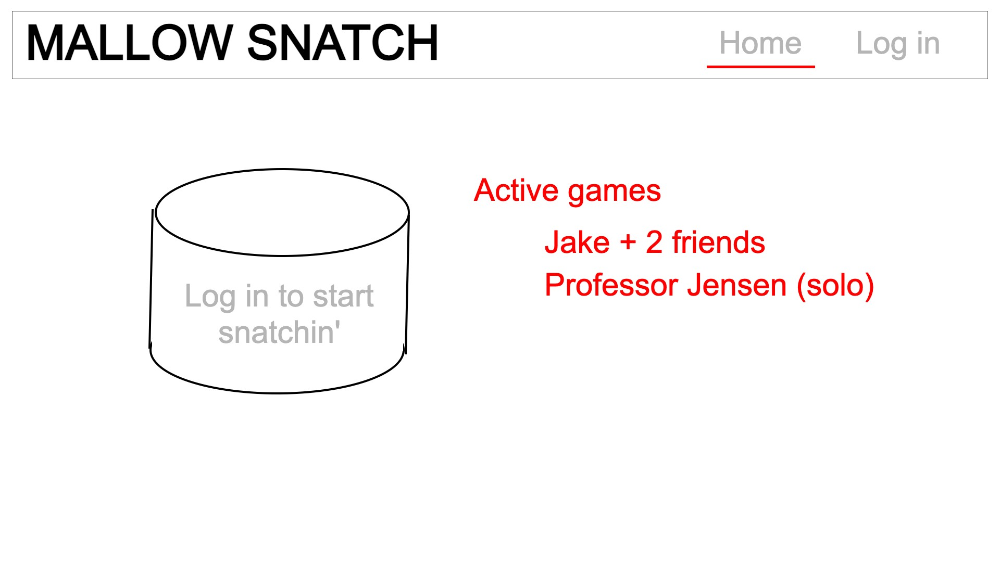
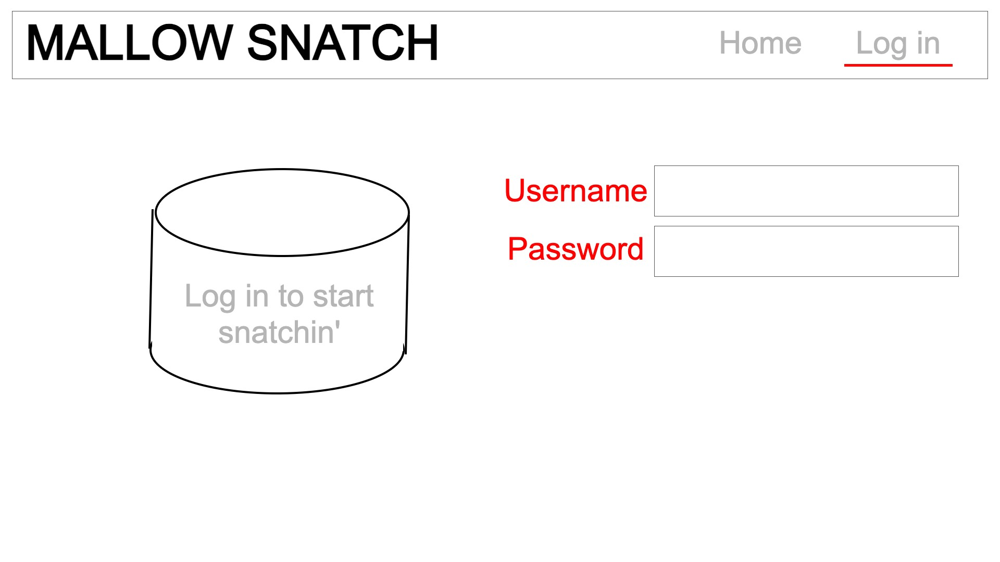
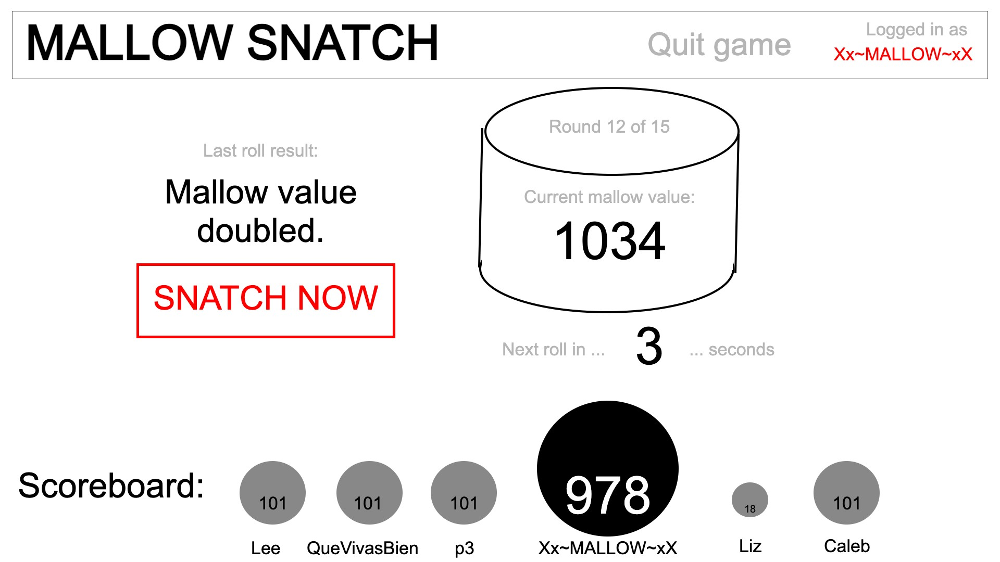

# Mallow Snatchers
An application for CS

## Specification Deliverable
### Elevator Pitch
Tired of family parties that inevitably just turn into awkward venting sessions? Look no further!
Mallow Snatchers is a fast-paced bidding game for the whole family! Be careful though---the more Mallows you grab, the more you'll want to keep playing, and you may have so much fun that you'll explode.

### Design

On the home screen, the user will be able to join an open game or create their own once they have an account.

This is an example of how the account creation/login screen would look.

Once a user is in a game, their only interaction with the server will be to tell the game when they "snatch" during each round of gameplay. The server will "roll" every three seconds and either add Mallows to a running total or end the round, depending on a random numnber generation.
If a user "snatches," they get as many Mallows as are on the running total at that time, but are locked in with that point value even if the number of Mallows increases with subsequent "rolls." If the server's random number determines that a given roll has ended the round, any player that failed to "snatch" gets 0 mallows.

A running Mallow total is displayed along the bottom of the screen, where a user's icon might increase in size in accordance with their point total.

### Key features
- Secure login and stored username
- Ability to join or create games
- Point totals from each user updated in real time
- Gameplay continues automatically until the end of all 15 rounds

### Technologies
I will use...
- **HTML** to structure the login and home screens and the UI for gameplay
- **CSS** to style the application objects and make sure things scale effectively for different systems
- **JAVASCRIPT** to handle user input and gameplay feedback
- **BACKEND SERVICE** to verify login and countdown timer/random number generator during gameplay
- **DB/LOGIN** to record login information: users must register to play.
- **WebSocket** to handle the communication between the "dealer" and the players; user input on one machine must be reflected in updates on the other players' devices so that the score and gameplay is consistent across all fronts.
- **React** to make the application look really good once I figure out how to use it.

## HTML Deliverable
### Requirements
For this deliverable I deployed the Simon HTML to my server and built the structure for my startup application using HTML.
- Simon HTML deployed to the production environment:
[simon HTML page](simon.mallowsnatchers.click)
- Startup HTML deployed to production environment:
[startup HTML page](startup.mallowsnatchers.click)
- **HTML pages** - Four pages. One default screen where a user is asked to register or log in. A lobby for creating or joining a game. A page for gameplay. An about page with instructions and all time best scores.
- **Links** - Nav menu links between different pages. Home page links to join. Join links to play. Play links to join if you quit.
- **Text** - There clearly is text in this webpage :)
- **3rd party service calls** - I might need to rely on a 3rd party service to do authentication or provide a random number for increasing the count on the mallow-meter during gameplay.
- **Images** - Mallow icon is visible in top-left, during game play, and on the scoreboard. Scale on scoreboard corresponds to a player's current score.
- **Login placeholder** - Visible on home page (index.html)
- **Database data placeholder** - Usernames/passwords/high scores are stored persistently on the site
- **WebSocket** - Will need to be used to update scores accross the players. If I am smart I can probably just get away with having the users send a flag when they click "snatch" and the server automatically calculates and distributes scoring information as the game progresses.

## CSS Deliverable
- [x] - done = [x] - done - Prerequisite: [Simon CSS](simon.mallowsnatchers.click) deployed to my production environment. I modified the file to make one of the links red and the main screen content align to the right side of the screen.
- [x] - done - Prerequisite: [Startup CSS](startup.mallowsnatchers.click) deployed to my production environment.
- [x] - done - Prerequisite: Updated notes in README.md
- [x] - done - 30% Header, footer, and main content body. Used flex to layout sections.
- [x] - done - 20% Navigation elements. For large screens, navigation menu in header. For small screens, the user navigates with the flow of the app, but doesn't ever go to the about screen.
- [x] - done - 10% Responsive to window resizing. Verified in debugger and on phone/computer.
- [x] - done - 20% Application elements. Buttons are using bootstrap.
- [x] - done - 10% Application text content. Sans-serif text.
- [x] - done - 10% Application images. Responsive sizing of mallow image; I'm especially proud of the home screen image dynamic sizing.

## Javascript Deliverable
[x] Simon Javascript deployed to production environment.
[x] Startup Javascript application specifications:
- Scoring information is added to a "database" which is mocked using localStorage to create a score table on the About page that updates each time you play a game.
- At login, your username is recorded and used during gameplay and in the high score table
- Mocked database data is injected into the DOM in the score table.
- Localstorage keeps the username information and player high scores for now.
- In the future I'm going to have this game work with multiplayer functionality; people on other computers will be able to log in to the same game on their devices. When other players "snatch," their scores and mallow sizes will be updated accordingly in the scoreboard.

[x] Name and contact information displayed in the footer.
[x] Code pushed to GitHub.
[x] Code deployed to production environment.

## Service Deliverable
[x] Simon service deployed to production environment
[x] Startup application updated so it implements a web service:
- Backend server stores and hands over high scores to the client
[x] Startup uses Express middleware
[x] Endpoints proviced in backend
[x] Frontend code calls endpoints to get and consider new high scores
[x] Frontend code calls for third party services:
- Inspirational quote at the bottom of the main page (if you're on desktop; hidden for small screens)
[x] Debugged using node.js and browser dev tools
[x] Periodic commits, notes.md updated, final version pushed to GitHub
[x] Startup application live in production environment

## Login Deliverable
[x] New users can be added using credentials on the home page.
[x] Existing users' credentials are encrypted and stored in MongoDB
[x] Existing users are authenticated by comparing the credentials against those stored in the database.
[x] You cannot play the game without logging in, but anyone can see the high scores. (High scores are in the about page.)
[x] Top scores are stored in MongoDB -- this means I don't just save the top 10 anymore, because I'm not restricted by the size of the server memory.
[x] Simon and Startup deployed to production environment.

## Websocket Deliverable
[x] Simon websocket deployed to the development environment.
[x] Backend processes incoming WS requests
[x] Frontend depends on WS messages to direct user traffic and provide multiplayer functionality
[x] Final version of the code pushed to GitHub
In this deliverable I had to make two additional HTML pages so there's a lobby before a game is started by a host, and so that players that aren't the host have just a simple UI where they hit the "snatch" button and WS handles delivering the message to the host. Host's frontend handles all the gameplay processing and submits the high scores at the end.

## React Deliverable
[x] Simon React deployed to production environment.
[x] Ported Startup code over to React. This version is a little jankier than my WebSocket submission (as if that were possible), but it is good enough for me to say I learned what I wanted to learn.
[x] Updated code pushed to GitHub, launched to production environment.
